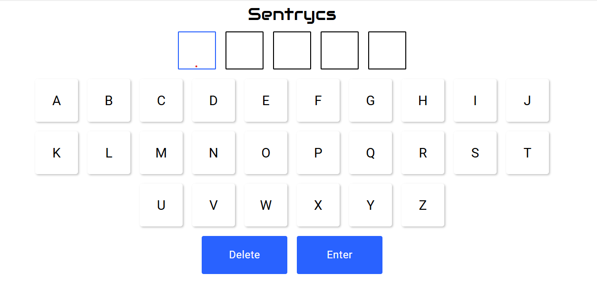

# Sentrycs - Word Checker

A React application for checking English words.

## Description

This application enables users to verify whether a 5-letter word exists in the English language. Users can enter words using an on-screen virtual keyboard. The app then checks the validity of the word and provides immediate feedback.

## Requirement
To communicate between components, you should use event listeners. This allows components to respond to user actions or changes in state by emitting and handling custom events.

### Prerequisites

- Node.js 18.15.0+
- Docker 
- GIT

## Technologies

- React 19
- TypeScript
- Material-UI (MUI)
- Docker (with Dockerfile for deployment)

## Installation & Usage

1. Install dependencies:
   ```bash
   npm install
   ```
2. Run in development mode:
   ```bash
   npm start
   ```
3. Build the project:
   ```bash
   npm run build
   ```
4. Run with Docker:
   ```bash
   docker build -t sentrycs-app .
   docker run -p 3000:3000 sentrycs-app
   ```

## Project Structure

- `src/components` - React components (keyboard, input fields, buttons)
- `src/providers` - Global state management with React Context
- `src/utils` - Utility functions (word validation)
- `src/theme` - Theme configuration
- `src/styledComponents` - Styled components
- `public/assets/fonts` - Custom fonts

---




